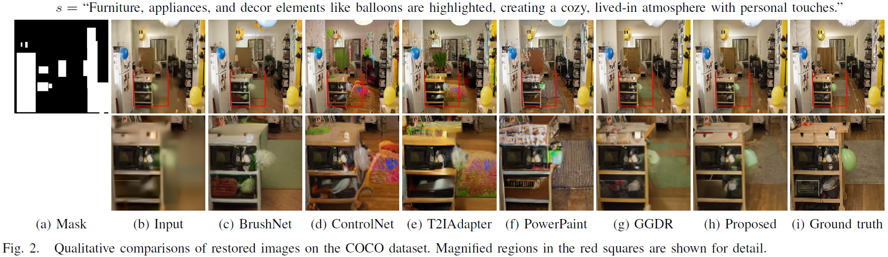

<!-- PROJECT LOGO -->
 

  <!--  -->

  <h2 align="center">Text-Guided Diffusion-Based Restoration of \\ Extremely Compressed Backgrounds for VCM</h2>

  

    <a href="mailto:daole@mme.dongguk.edu" target="_blank">Le Thi Hue Dao</a>1,
    <a href="mailto:klemon@dgu.ac.kr" target="_blank">Naeun Yang</a>2,
    <a href="mailto:leejy1003@etri.re.kr" target="_blank">Jooyoung Lee</a>3,
    <a href="mailto:jsy@etri.re.kr" target="_blank">Seyoon Jeong</a>3, and 
    <a href="mailto:chullee@dongguk.edu" target="_blank">Chul Lee</a>1,2
     
    1Department of Multimedia Engineering, Dongguk University, South Korea 
    2Department of Computer Science and Artificial Intelligence, Dongguk University, South Korea
     
    3Electronics and Telecommunications Research Institute, Daejeon, South Korea 
     
    (submitted in May 2025)
  

 

# Qualitative Results

  

 

The code will be released soon.

